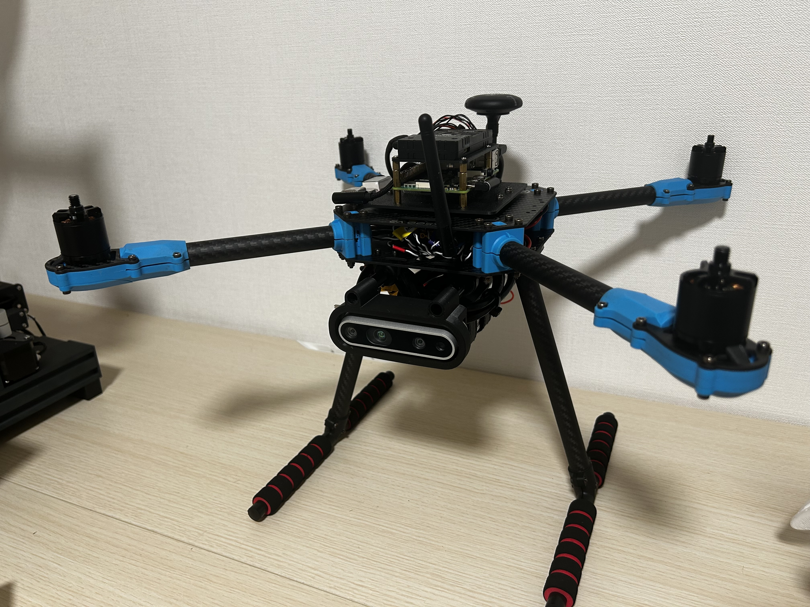

# Realsense D435i Mount For Holybro X500

A 3D printable mount for attaching Intel RealSense D435i camera to Holybro X500 drone.

## Overview

This repository contains STL files for mounting a RealSense D435i depth camera onto a Holybro X500 drone frame. The mount is designed to provide a secure and stable attachment point for the camera.

## Contents

- `realsense_mount.stl` - 3D printable mount file

## Hardware

- **Drone**: [Holybro X500](https://holybro.com/products/px4-development-kit-x500-v2)
- **Camera**: [Intel RealSense D435i](https://www.intel.com/content/www/us/en/products/sku/190004/intel-realsense-depth-camera-d435i/specifications.html)

## Usage

1. Download the `realsense_mount.stl` file
2. 3D print the mount using your preferred settings
3. Attach the RealSense D435i camera to the mount
4. Install the mount on your Holybro X500 drone frame

## License

This project is released under the MIT License. Feel free to use, modify, and distribute.
